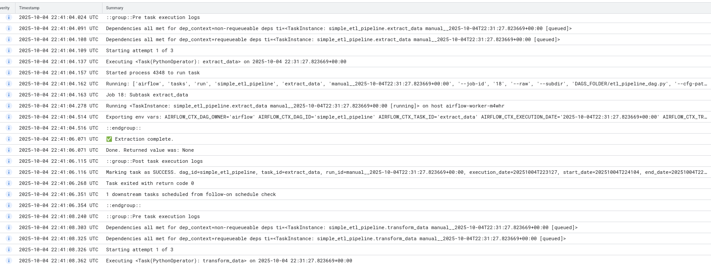
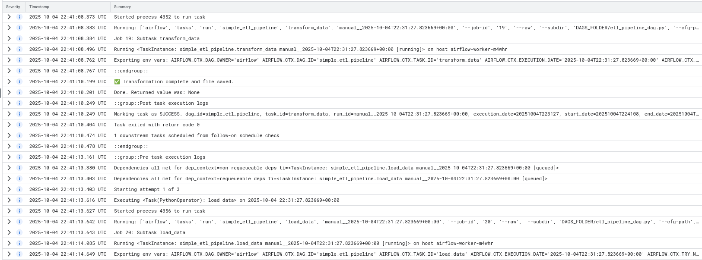
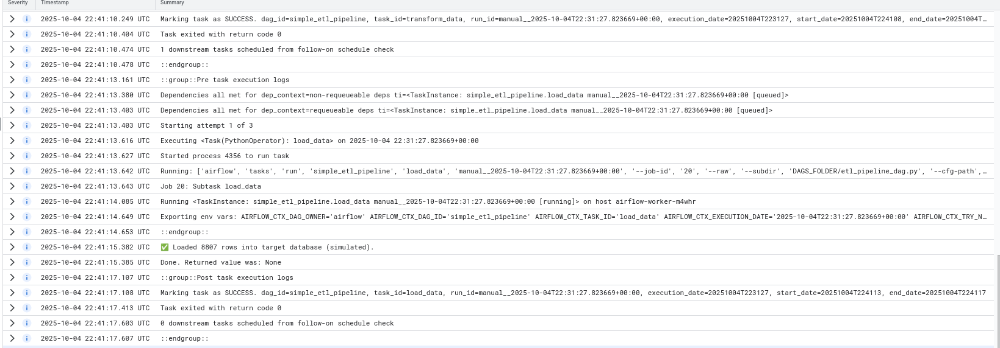

# Data Engineering Project 3 — ETL Pipeline with Apache Airflow

## 🧠 Overview
This project demonstrates a simple ETL (Extract, Transform, Load) pipeline using **Apache Airflow** on **Google Cloud Composer**. The pipeline extracts data from a CSV file, performs column transformations, and loads it into a simulated target database.

---

## ⚙️ ETL Pipeline Flow

1. **Extract** – Reads a CSV file (`netflix_titles.csv`) stored in a Google Cloud Storage bucket.  
2. **Transform** – Cleans and standardizes column formats (e.g., converts text to lowercase, formats dates).  
3. **Load** – Simulates loading the cleaned data into a target table.

---

## 📂 DAG Configuration
- **DAG Name:** `simple_etl_pipeline`  
- **Schedule:** `@daily`  
- **Owner:** `airflow`  
- **Environment:** `Google Cloud Composer`  
- **Tools Used:** Python, Airflow, GCP  

---

## 🧩 Key Components
- **Airflow DAG:** Defines the pipeline tasks and dependencies.  
- **Google Cloud Storage:** Hosts the CSV file.  
- **Cloud Composer:** Manages orchestration and monitoring.  

---

## 🧱 Tasks
| Task | Description | Status |
|------|--------------|---------|
| Extract Data | Reads data from CSV | ✅ Success |
| Transform Data | Cleans and formats columns | ✅ Success |
| Load Data | Simulates data load | ✅ Success |

---

## 📊 Results

### ✅ DAG Deployment

### ✅ DAG Visibility

### ✅ DAG Execution Logs

All tasks (`extract_data`, `transform_data`, and `load_data`) completed successfully, indicating the pipeline executed end-to-end without errors.

---

## 🚀 Takeaways
- Successfully deployed a working **ETL pipeline** on **Google Cloud Composer (Airflow)**.  
- Demonstrated orchestration of data extraction, transformation, and loading tasks.  
- Validated understanding of Airflow DAG structure, task dependencies, and environment setup.  

